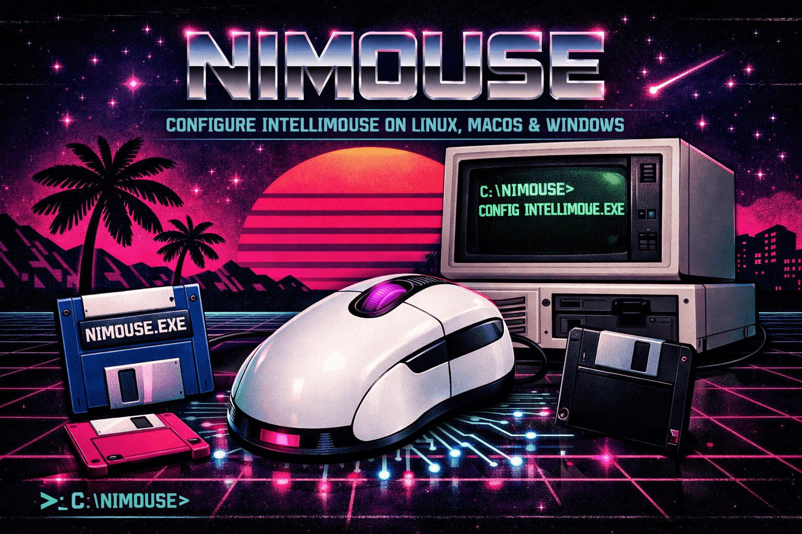

# nimouse

A command-line tool for configuring Microsoft IntelliMouse devices on Linux, macOS, and Windows. Written in Nim.

```
$ nimouse get 0 --all
Microsoft Pro IntelliMouse:
  color:              #FF0000  ██
  dpi:                1600
  polling rate:       1000 Hz
  lift-off distance:  2 mm
  back button:        BackButton
  middle button:      MiddleClick
```

**Copyright © 2026 Luciano Federico Pereira** — MIT License  
Adapted from [intellimouse-ctl](https://github.com/k-visscher/intellimouse-ctl) by Kim Visscher (© 2022, MIT)

---

## Features

| Feature               | Pro IntelliMouse (2019) | Classic IntelliMouse (2017) |
|-----------------------|:-----------------------:|:---------------------------:|
| DPI                   | 200 – 16 000 (×50)      | 400 – 3 200 (×200)          |
| LED tail-light color  | ✓ (16M colors)          | —                           |
| Polling rate          | 125 / 500 / 1000 Hz     | —                           |
| Lift-off distance     | 2 mm / 3 mm             | —                           |
| Button remapping      | ✓ back + middle         | —                           |
| Config file           | ✓                       | ✓                           |
| JSON output           | ✓                       | ✓                           |
| Shell completion      | ✓                       | ✓                           |

---

## Install

### Dependencies

**Linux (Debian/Ubuntu)**
```bash
sudo apt install libhidapi-dev
```

**Linux (Arch)**
```bash
sudo pacman -S hidapi
```

**macOS**
```bash
brew install hidapi
```

**Windows** — download `hidapi.dll` from the [hidapi releases page](https://github.com/libusb/hidapi/releases) and place it next to the binary.

### Build from source

```bash
# Install Nim via choosenim (https://nim-lang.org/install.html)
curl https://nim-lang.org/choosenim/init.sh -sSf | sh

git clone https://github.com/yourusername/nimouse
cd nimouse
nimble install
```

This installs the `nimouse` binary to `~/.nimble/bin/`.

### Linux: run without sudo

Create `/etc/udev/rules.d/99-intellimouse.rules`:

```
# Microsoft Pro IntelliMouse
SUBSYSTEM=="hidraw", ATTRS{idVendor}=="045e", ATTRS{idProduct}=="082a", MODE="0666"
# Microsoft Classic IntelliMouse
SUBSYSTEM=="hidraw", ATTRS{idVendor}=="045e", ATTRS{idProduct}=="0823", MODE="0666"
```

Reload rules:

```bash
sudo udevadm control --reload-rules && sudo udevadm trigger
```

---

## Usage

```
nimouse <subcommand> [options]
```

### `list` — show connected devices

```bash
nimouse list
nimouse list --json
```

```
0. Microsoft Pro IntelliMouse
   path: /dev/hidraw2
```

---

### `get` — read settings

```bash
nimouse get 0 --all                        # everything
nimouse get 0 --dpi                        # single setting
nimouse get 0 --dpi --color --polling-rate # multiple
nimouse get 0 --back-button --middle-button
nimouse get 0 --all --json                 # machine-readable
```

**Flags**

| Flag               | Description                        |
|--------------------|------------------------------------|
| `--dpi`            | DPI value                          |
| `--color`          | LED tail-light color (hex + preview)|
| `--polling-rate`   | Polling rate in Hz                 |
| `--lift-off-distance` | Lift-off distance in mm         |
| `--back-button`    | Current back button action         |
| `--middle-button`  | Current middle button action       |
| `--all`            | All of the above (default)         |
| `--json`           | Output as JSON                     |

---

### `set` — change settings

```bash
nimouse set 0 --dpi=1600
nimouse set 0 --polling-rate=500           # 125 | 500 | 1000
nimouse set 0 --lift-off-distance=2        # 2 | 3
```

**LED color** — accepts hex strings, named colors, or decimals:

```bash
nimouse set 0 --color=red
nimouse set 0 --color="#FF8800"
nimouse set 0 --color=0xFF8800
nimouse set 0 --color=off                  # turn off the light
```

Named colors: `red` `green` `blue` `white` `purple` `cyan` `yellow` `orange` `pink` `off`

**Button remapping** — use `nimouse button-actions` to list valid action names:

```bash
nimouse set 0 --back-button=BrowserForward
nimouse set 0 --middle-button=DpiShift
nimouse set 0 --back-button=IncreaseDpi --middle-button=DecreaseDpi
```

---

### `button-actions` — list remappable actions

```bash
nimouse button-actions
```

```
Available button actions:
  BackButton
  BrowserForward
  MiddleClick
  HorizVertToggle
  DpiShift
  IncreaseDpi
  DecreaseDpi
  KeyCombination
  Alt
  Ctrl
  Shift
  Enter
```

---

### `config-save` / `config-load` — persist settings

Save the current device settings to disk:

```bash
nimouse config-save
nimouse config-save --index=1   # save device at index 1
```

Restore them later (e.g. on login):

```bash
nimouse config-load
```

Config file location: `$XDG_CONFIG_HOME/nimouse/config.ini`
(defaults to `~/.config/nimouse/config.ini`)

```ini
[defaults]
index = 0

[pro]
dpi = 1600
polling_rate = 1000
lift_off_distance = 2
color = 16711680

[classic]
dpi = 1600
```

To apply settings automatically on login, add `nimouse config-load` to your
`.profile`, `.bash_profile`, or a systemd user service.

---

### Shell completion

```bash
# bash — add to ~/.bashrc
source <(nimouse --help-syntax bash)

# zsh — add to ~/.zshrc
source <(nimouse --help-syntax zsh)

# fish — add to ~/.config/fish/config.fish
nimouse --help-syntax fish | source
```

---

## Protocol

The USB HID protocol used to communicate with these mice has been
reverse-engineered by the community. See [PROTOCOL.md](PROTOCOL.md) for full
technical details including all property codes, byte layouts, and known button
action codes.

Sources used:
- [xlanor/intellimouse](https://github.com/xlanor/intellimouse) — USB packet captures and Go implementation
- [namazso/ProIntelliColor](https://github.com/namazso/ProIntelliColor) — independent C verification
- [k-visscher/intellimouse-ctl](https://github.com/k-visscher/intellimouse-ctl) — original Python library

---

## License

MIT — see [LICENSE](LICENSE)

Copyright © 2026 Luciano Federico Pereira  
Adapted from intellimouse-ctl by Kim Visscher (© 2022)
